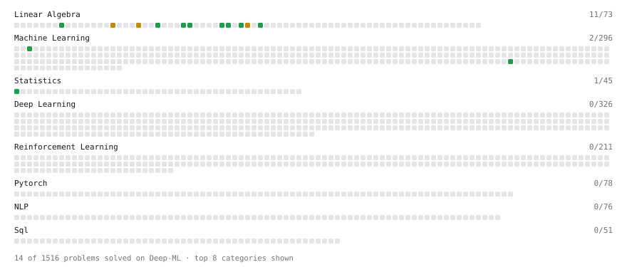

# Deep-ML

My machine learning practice from [Deep-ML](https://www.deep-ml.com). Every solution here was written by hand.

**38** solved · 10 problems · 0 labs · 28 math

[**Browse the interactive portfolio**](https://SerinaTraore.github.io/deep-ml/) to replay this filling in over time.

## Problems

| | Difficulty | Solved | |
| --- | --- | --- | --- |
| [Calculate 2x2 Matrix Inverse](https://www.deep-ml.com/problems/8) | easy | 2026-10-01 | [solution](problems/0008-calculate-2x2-matrix-inverse) |
| [Calculate Covariance Matrix](https://www.deep-ml.com/problems/10) | easy | 2026-10-01 | [solution](problems/0010-calculate-covariance-matrix) |
| [Check Linear Independence of Vectors](https://www.deep-ml.com/problems/331) | easy | 2026-10-01 | [solution](problems/0331-check-linear-independence-of-vectors) |
| [Feature Scaling Implementation](https://www.deep-ml.com/problems/16) | easy | 2026-09-29 | [solution](problems/0016-feature-scaling-implementation) |
| [Implement Orthogonal Projection of a Vector onto a Line](https://www.deep-ml.com/problems/66) | easy | 2026-10-01 | [solution](problems/0066-implement-orthogonal-projection-of-a-vector-onto-a-line) |
| [Matrix Determinant & Trace](https://www.deep-ml.com/problems/195) | easy | 2026-10-01 | [solution](problems/0195-matrix-determinant-trace) |
| [Random Train/Validation/Test Split with Shuffling](https://www.deep-ml.com/problems/1058) | easy | 2026-09-29 | [solution](problems/1058-random-train-validation-test-split-with-shuffling) |
| [Calculate Correlation Matrix](https://www.deep-ml.com/problems/37) | medium | 2026-10-01 | [solution](problems/0037-calculate-correlation-matrix) |
| [Gaussian Elimination for Solving Linear Systems](https://www.deep-ml.com/problems/58) | medium | 2026-10-01 | [solution](problems/0058-gaussian-elimination-for-solving-linear-systems) |
| [Matrix Rank](https://www.deep-ml.com/problems/329) | medium | 2026-10-01 | [solution](problems/0329-matrix-rank) |

## Math

| | Difficulty | Solved | |
| --- | --- | --- | --- |
| [Matrix Basics](https://www.deep-ml.com/math-problems/9) | easy | 2026-10-02 | [solution](math/0009-matrix-basics) |
| [Vector Operations](https://www.deep-ml.com/math-problems/7) | easy | 2026-10-02 | [solution](math/0007-vector-operations) |
| [Backpropagation and the Chain Rule](https://www.deep-ml.com/math-problems/4) | medium | 2026-10-01 | [solution](math/0004-backpropagation-and-the-chain-rule) |
| [Bayes' Theorem](https://www.deep-ml.com/math-problems/20) | medium | 2026-10-01 | [solution](math/0020-bayes-theorem) |
| [Common Distributions I: Bernoulli, Binomial, Uniform](https://www.deep-ml.com/math-problems/21) | medium | 2026-10-01 | [solution](math/0021-common-distributions-i-bernoulli-binomial-uniform) |
| [Common Distributions II: Normal, Poisson, Exponential](https://www.deep-ml.com/math-problems/22) | medium | 2026-10-01 | [solution](math/0022-common-distributions-ii-normal-poisson-exponential) |
| [Covariance and Correlation](https://www.deep-ml.com/math-problems/17) | medium | 2026-09-30 | [solution](math/0017-covariance-and-correlation) |
| [Determinants and Trace](https://www.deep-ml.com/math-problems/11) | medium | 2026-09-30 | [solution](math/0011-determinants-and-trace) |
| [Information Theory: Entropy](https://www.deep-ml.com/math-problems/24) | medium | 2026-10-02 | [solution](math/0024-information-theory-entropy) |
| [Inverse and Rank](https://www.deep-ml.com/math-problems/12) | medium | 2026-09-30 | [solution](math/0012-inverse-and-rank) |
| [Law of Large Numbers and Central Limit Theorem](https://www.deep-ml.com/math-problems/23) | medium | 2026-10-01 | [solution](math/0023-law-of-large-numbers-and-central-limit-theorem) |
| [Log-Likelihood Gradients](https://www.deep-ml.com/math-problems/38) | medium | 2026-10-02 | [solution](math/0038-log-likelihood-gradients) |
| [Logistic Regression as Maximum Likelihood](https://www.deep-ml.com/math-problems/40) | medium | 2026-09-30 | [solution](math/0040-logistic-regression-as-maximum-likelihood) |
| [Matrix Calculus Identities](https://www.deep-ml.com/math-problems/35) | medium | 2026-09-30 | [solution](math/0035-matrix-calculus-identities) |
| [Matrix Multiplication](https://www.deep-ml.com/math-problems/10) | medium | 2026-10-02 | [solution](math/0010-matrix-multiplication) |
| [Multivariate Calculus](https://www.deep-ml.com/math-problems/2) | medium | 2026-09-30 | [solution](math/0002-multivariate-calculus) |
| [Multivariate Gaussians](https://www.deep-ml.com/math-problems/36) | medium | 2026-10-01 | [solution](math/0036-multivariate-gaussians) |
| [Neural Network Derivatives](https://www.deep-ml.com/math-problems/3) | medium | 2026-10-01 | [solution](math/0003-neural-network-derivatives) |
| [Optimization: Convexity and Critical Points](https://www.deep-ml.com/math-problems/6) | medium | 2026-10-02 | [solution](math/0006-optimization-convexity-and-critical-points) |
| [Orthogonality and Projections](https://www.deep-ml.com/math-problems/14) | medium | 2026-09-30 | [solution](math/0014-orthogonality-and-projections) |
| [Softmax and Cross-Entropy](https://www.deep-ml.com/math-problems/32) | medium | 2026-10-01 | [solution](math/0032-softmax-and-cross-entropy) |
| [Solving Linear Systems](https://www.deep-ml.com/math-problems/13) | medium | 2026-09-30 | [solution](math/0013-solving-linear-systems) |
| [Taylor Expansions and Local Quadratic Models](https://www.deep-ml.com/math-problems/37) | medium | 2026-10-01 | [solution](math/0037-taylor-expansions-and-local-quadratic-models) |
| [Vector Norms and Linear Independence](https://www.deep-ml.com/math-problems/8) | medium | 2026-10-02 | [solution](math/0008-vector-norms-and-linear-independence) |
| [Eigendecomposition and SVD](https://www.deep-ml.com/math-problems/16) | hard | 2026-10-02 | [solution](math/0016-eigendecomposition-and-svd) |
| [KL Divergence](https://www.deep-ml.com/math-problems/25) | hard | 2026-10-02 | [solution](math/0025-kl-divergence) |
| [Matrix Decompositions: LU and QR](https://www.deep-ml.com/math-problems/15) | hard | 2026-10-02 | [solution](math/0015-matrix-decompositions-lu-and-qr) |
| [Maximum Likelihood and MAP](https://www.deep-ml.com/math-problems/26) | hard | 2026-10-02 | [solution](math/0026-maximum-likelihood-and-map) |

---

_This file is regenerated by Deep-ML on every push._
